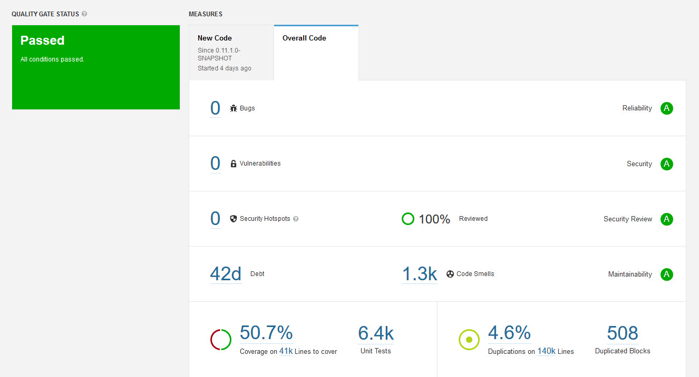

# About this fork

This fork aims to be a "batteries-included" solutions to let the project run on arch linux. See the [installation manual](./ARCH_INSTALLATION.md).

You need [git lfs](https://git-lfs.github.com/)

# Swiss Post Voting System

The Swiss Post Voting System is a return code-based remote online voting system that provides individual verifiability, universal verifiability, and
vote secrecy.

* Individual verifiability: allow a voter to convince herself that the system correctly registered her vote
* Universal verifiability: allow an auditor to check that the election outcome corresponds to the registered votes
* Vote secrecy: do not reveal a voter's vote to anyone

## System Documentation

We provide [extensive documentation](https://gitlab.com/swisspost-evoting/e-voting/e-voting-documentation/-/tree/master)
for the Swiss Post Voting System containing the following documents:

* [Detailed system specification](https://gitlab.com/swisspost-evoting/e-voting/e-voting-documentation/-/tree/master/System)
* [Cryptographic proofs of verifiability and vote secrecy](https://gitlab.com/swisspost-evoting/e-voting/e-voting-documentation/-/tree/master/Protocol)
* [System architecture](https://gitlab.com/swisspost-evoting/e-voting/e-voting-documentation/-/blob/master/System/SwissPost_Voting_System_architecture_document.pdf)
* [Infrastructure whitepaper](https://gitlab.com/swisspost-evoting/e-voting/e-voting-documentation/-/blob/master/Operations/Infrastructure%20whitepaper%20of%20the%20Swiss%20Post%20voting%20system.md)

## Changes since 2019

Since the source code's publication in 2019, we improved the source code in the following regards.

* Aligned the source code more faithfully to the system specification.
* Increased the source code's auditability and maintainability.
* Eliminated dead code and redundancies.
* Reduced the overall number of third-party dependencies, updating the remaining in addition to improving framework usage.
* Improved the general code quality.

## Code Quality

To improve code quality, we focus on the following tools:

| Tool        | Focus                 |
|-------------|-----------------------|
| [SonarQube](https://www.sonarqube.org/)  | Code quality and code security      |
| [JFrog X-Ray](https://jfrog.com/xray/) | Common vulnerabilities and exposures (CVE) analysis, Open-source software (OSS) license compliance | |

### SonarQube Analysis

We parametrize SonarQube with the built-in Sonar way quality profile. The SonarQube analysis of the evoting code reveals 0 bugs and 0
vulnerabilities. Moreover, we manually reviewed the security hotspots and identified no security issues. While we significantly reduced the number
from the source code of 2019, we still have >1'300 code smells in the code. [Code smells](https://docs.sonarqube.org/latest/user-guide/concepts/) are
maintainability-related issues that might increase the likelihood of errors in future code changes but do not directly impact the code's security and
robustness. An example would be a method that contains too many if/else statements, therefore has a high cognitive complexity, hence is difficult to maintain.
We plan to fix code smells continuously in future versions of the e-voting solution.



### JFrog X-Ray Analysis

When writing (August 2021), the published source code does not contain any directly dependent component with known vulnerabilities.

## Known Issues

The current version of the source code has the following known issues:

* The source code is not fully aligned to the specification version 0.9.7:
    * The GenVerDat and CreateLCCShare algorithms do not implement the partial Choice Return Codes allow list. This point refers
      to [Gitlab issue #7](https://gitlab.com/swisspost-evoting/e-voting/e-voting-documentation/-/issues/7)
    * The control components do not check the list of ballot boxes that they already partially decrypted. This refers
      to [Gitlab issue #11](https://gitlab.com/swisspost-evoting/e-voting/e-voting-documentation/-/issues/11)
    * The control component's zero-knowledge proofs and hash function slightly differ in the implementation from the specification. For instance, 
      the auxiliary string contains different information and the specification uses the *RecursiveHash* function while the implementation uses a different one.
    * The DecryptPCC_j algorithm is not implemented. Currently, the voting server decrypts the PCC and sends them to the control components.
    * The control components do not receive the CCR_j Choice Return Codes Encryption public keys during the configuration phase. They only received
      the combined Choice Return Codes Encryption public key during voting (signed by the administration board key)
* We plan for a typescript implementation of the crypto-primitives implementation (open-source) that follows the crypto-primitives specification and
  implements the voting client's zero-knowledge proofs. The typescript implementation is going to address the following points:
    * The EncodeVotingOptions method is currently implemented outside the *CreateVote* algorithm
    * The implementation's zero-knowledge proof currently do not include the complete statement of the specification and use a different hash function
* Write-ins are currently not supported
* Some cryptographic primitives are implemented both in the crypto-primitives and the cryptolib (for instance the ElGamal encryption scheme). The
  implementations are functionally equivalent. We are continously replacing the cryptolib implementation with the more robust crypto-primitives one.
* The voter portal (a component considered untrustworthy in our threat model) is built using AngularJS. Even though there are long-term support
  options, covering both security weaknesses and future browser compatibility support, ideally, the frontend would be migrated to / rewritten in
  Angular.
* In some cases, publicly writable directories are used as temporary storage. The security risk associated is mitigated as we run such services in a
  containerized environment, where we control all the running processes. We plan to remove the use of temporary storage completely.

## Future Work

We plan the following work for future releases.

* Explicitly implement the DecodePlaintexts algorithm. Currently, the output of the system consists of the encoded voting options (prime numbers).
  Please note that the verifier checks the decoding of the prime numbers.
* Reduce the number of code smells and increase test coverage. We will prioritize code that implements important elements of the cryptographic protocol.
* The voting server is *untrusted*: we distributed many functionalities to the mutually independent control components in the current protocol.
  However, for historical reasons, the voting server still performs additional validations not strictly necessary from the protocol point of view.
  Moreover, the voting server uses the JavaEE framework, while the other parts of the solution use SpringBoot. To improve maintainability, we want to
  reduce the voting server's responsibility to the strict minimum and align it to SpringBoot.
* Ensure reproducible builds, see the [section on reproducible builds](#Reproducible-Builds).

## Limitations

Regardless of how well-built a software system is, technical debt accrues over time. The architecture documentation (chapter 11) lists technical
debts.

Moreover, no cryptographic protocol is unconditionally secure.
The [cryptographic protocol's documentation](https://gitlab.com/swisspost-evoting/e-voting/e-voting-documentation/-/tree/master/Protocol#Limitations)
highlights limitations regarding quantum-resistance, attacks against vote privacy on a malicious voting client, and a trustworthy printing component.

## Build Prerequisites

We tested the build with the following operating systems and configurations:

* Windows (Microsoft Windows 10 Enterprise, 10.0.18363, Java 1.8.0_302 (AdoptOpenJDK), Apache Maven 3.8.2)
* macOS (Mojave 10.14.6, Java 1.8.0_252 (AdoptOpenJDK), Apache Maven 3.6.3)
* Linux (debian 4.19.0-17-amd64, OpenJDK Runtime Environment 1.8.0_282-b08, Apache Maven 3.6.0)

Please note that you might have to adapt specific steps if you use a different distribution or configuration.

### Enable Long Path (Windows)

Long paths can be enabled as explained
here: [https://docs.microsoft.com/en-us/windows/win32/fileio/maximum-file-path-limitation#enable-long-paths-in-windows-10-version-1607-and-later](https://docs.microsoft.com/en-us/windows/win32/fileio/maximum-file-path-limitation#enable-long-paths-in-windows-10-version-1607-and-later)

Restarting your machine is required for this change to be effective. Activate long paths for Git with the command below:

```sh
git config --global core.longpaths true
```

### Clone the Project

1. Install [Git](https://git-scm.com/)
2. Clone this repository with the command below:

```sh
git clone https://gitlab.com/swisspost-evoting/e-voting/e-voting.git
```

### Prepare Build Environment

You must install the following tools to build the e-voting solution. We recommend installing them in a dedicated directory (e.g., C:
\work\jrepo-local\tools). Due to a [bug in java-jdk1.8.0_292](https://bugs.openjdk.java.net/browse/JDK-8266929) - fixed in version 302 - the build
under Linux fails with version 292.

| Name     | Version    | Source    | Install Location (if installed under C:\work\jrepo-local\tools)    |
| --------|---------|---------|---------|
| **Java**  | Adopt OpenJDK 1.8.0_302b08    | [https://github.com/adoptium/temurin8-binaries/releases/tag/jdk8u302-b08](https://github.com/adoptium/temurin8-binaries/releases/tag/jdk8u302-b08) | C:\work\jrepo-local\tools\java\java-jdk1.8.0_302b08 |
| **Chrome** | > = 59 | [https://www.google.com/intl/de/chrome/](https://www.google.com/intl/de/chrome/) | Default |
| **Node** | 14.17.0  | [https://nodejs.org/dist/v14.17.0/](https://nodejs.org/dist/v14.17.0/) | C:\work\jrepo-local\tools\node\node-v14.17.0-x64 |
| **Maven** | 3.8.2  | [https://downloads.apache.org/maven/maven-3/3.8.2/binaries/](https://downloads.apache.org/maven/maven-3/3.8.2/binaries/) | C:\work\jrepo-local\tools\maven\maven-3.8.2 |
| **PhantomJS** | 2.1.1 | [https://bitbucket.org/ariya/phantomjs/downloads/phantomjs-2.1.1-windows.zip](https://bitbucket.org/ariya/phantomjs/downloads/phantomjs-2.1.1-windows.zip) | C:\work\jrepo-local\tools\phantomjs\phantomjs-2.1.1-windows |

#### Prepare Environment Variables

Create the following system environment variables (adapt them to the location you installed the build tools in the step above):

| Name     | Version    |
| --------|---------|
| **DOCKER_REGISTRY**  | registry.gitlab.com/swisspost-evoting/e-voting/evoting-e2e-dev  |
| **EVOTING_HOME**  | C:\work\projects\e-voting (it should point to the directory where this repository was cloned)    |
| **JAVA_HOME** | C:\work\jrepo-local\tools\java\java-jdk1.8.0_302b08 |
| **MAVEN_HOME** | C:\work\jrepo-local\tools\maven\maven-3.8.2  |
| **NODE_HOME** | C:\work\jrepo-local\tools\node\node-v14.17.0-x64  |
| **NPM_ROAMING_HOME** | C:\Users\\${username}\AppData\Roaming\npm  |
| **PHANTOMJS_HOME** | C:\work\jrepo-local\tools\phantomjs\phantomjs-2.1.1-windows |

Linux distributions might require an additional environment variable CHROME_BIN pointing towards Chrome or Chromium. You can set the environment
variable as follows:

```sh
`export CHROME_BIN==$(which chromium google-chrome | awk '!/not found/'
```

#### Prepare PATH

Add the following lines to your PATH system environment variable:

```sh
%JAVA_HOME%\bin
%MAVEN_HOME%\bin
%NODE_HOME%\
%NPM_ROAMING_HOME%\
%PHANTOMJS_HOME%\bin
```

#### Install Node Modules

Install the following NPM dependencies globally to allow a complete build of the frontends of the e-voting solution:

```sh
npm install -g grunt-cli@1.3.2
npm install -g gulp-cli@2.3.0
```

### Install Manual Third-Party Dependencies

The Secure Data Manager requires a PKCS11wrapper, developed by IAIK of Graz University of Technology, for interacting with SmartCards. The PKCS11
wrapper is not available in public repositories but can be obtained for free from IAIK's website under an Apache-style license (you can find the
license in the Secure Data Manager directory).

Therefore, you have to obtain yourself a copy of the
iaikPkcs11Wrapper [https://jce.iaik.tugraz.at/products/core-crypto-toolkits/pkcs11-wrapper/](https://jce.iaik.tugraz.at/products/core-crypto-toolkits/pkcs11-wrapper/)
and install it as a maven artifact using the following command:

```sh
mvn install:install-file -Dfile=iaikPkcs11Wrapper_1.6.2.jar -DgroupId=iaik -DartifactId=iaikPkcs11Wrapper -Dversion=1.6.2 -Dpackaging=jar 
```

### Check Environment Before Your First Build

Before your first build, you should check your environment using the provided script :

```sh
 cd ./scripts/
 ./environment-checker.sh
```

### Docker image

If you want to avoid preparing your own environment for the build, we provide a Docker image, based on a Linux distribution, with the main elements
already installed. The Docker image is located in the `scripts` directory, in a file
named [evoting-build.Dockerfile](./scripts/evoting-build.Dockerfile). All the steps that will then remain are:

* Build the Docker image
  ```sh
  docker build -f evoting-build.Dockerfile -t evoting-build .
  ```
* Run a container based on the previous image. Give at least 4Go of memory to the Docker daemon
  ```sh
  docker run -v <static-path-directory-to-exchange-data>:/home/baseuser/data -it -t evoting-build
  ```
* Clone the project
  ```sh
  git clone https://gitlab.com/swisspost-evoting/e-voting/e-voting.git
  cd e-voting
  ```
* [Install the third-party dependencies](#install-manual-third-party-dependencies) as described above
* [Launch the full build](#full-build) as described below

## Build

### Full Build

Clone the crypto-primitives into the 'evoting' directory, build the crypto-primitives,
then build the e-voting solution:

```sh
 git clone https://gitlab.com/swisspost-evoting/crypto-primitives/crypto-primitives.git
 cd crypto-primitives && mvn clean install && cd ..
 mvn clean install
```

### Partial Build

If you want to build partially the solution (only a module) :

```sh
 cd ./your-module/
 mvn <goals>
```

### Reproducible Builds

We aim to provide [reproducible builds](https://reproducible-builds.org/), allowing researchers to verify the path from source code to binaries.
Currently, the build pipeline for the frontend artifacts is not entirely deterministic; we are evaluating different solutions to make the frontend
build reproducible (see [future work](#Future-Work)).

## Run

See the repository [evoting-e2e-dev](https://gitlab.com/swisspost-evoting/e-voting/evoting-e2e-dev) for instructions on how to simulate an election
event.

In contrast to the productive infrastructure, the development environment omits specific security elements such
as [HTTP security headers](https://owasp.org/www-project-secure-headers/), [DNSSEC](https://www.nic.ch/security/dnssec/)
, [OCSP](https://www.ietf.org/rfc/rfc2560.txt), and [CAA records](https://support.dnsimple.com/articles/caa-record/). You can check the voter portal
README to check our productive configuration of [HTTP security headers](https://owasp.org/www-project-secure-headers/).
